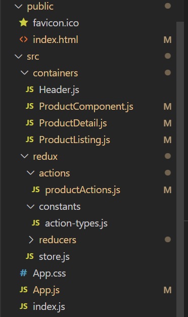

# Shopping App - React + Redux

## Installations

```bash
npx create-react-app shopping_app
npm install react-router-dom
npm install axios
npm install redux react-redux
// Delete all standard unnecesary boilerplate 

//Add in index.html
<script src="https://cdnjs.cloudflare.com/ajax/libs/semantic-ui/2.4.1/semantic.min.js"     integrity="sha512-dqw6X88iGgZlTsONxZK9ePmJEFrmHwpuMrsUChjAw1mRUhUITE5QU9pkcSox+ynfLhL15Sv2al5A0LVyDCmtUw=="     crossorigin="anonymous" referrerpolicy="no-referrer"></script>
```


